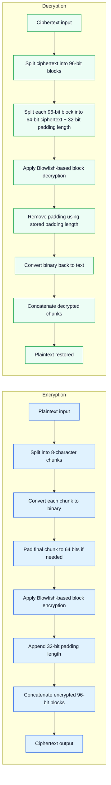

# Encryptor App

Project implementing a Blowfish-based encryptor inspired by the original paper, with a small simplification in my implementation.

For detailed information on the Blowfish encryption algorithm, see the original paper:
https://groups.csail.mit.edu/cag/pub/dm/papers/schneier:blowfish.html

## Encryption / Decryption Flow

## Repository layout

- `backend/` — Blowfish implementation in OCaml.
  - `bin/main.ml` — Top level which exposes the backend.
  - `lib/` — Blowfish implementation code.
  - `data/` — Files of constants used by the Blowfish algorithm.
  - `test/` — OCaml test cases.
- `encryptor-ui/` — React frontend in TypeScript.
  - `src/` — React component code.

## Hosted Application
Live app: **https://jg-encryptor.vercel.app/**
